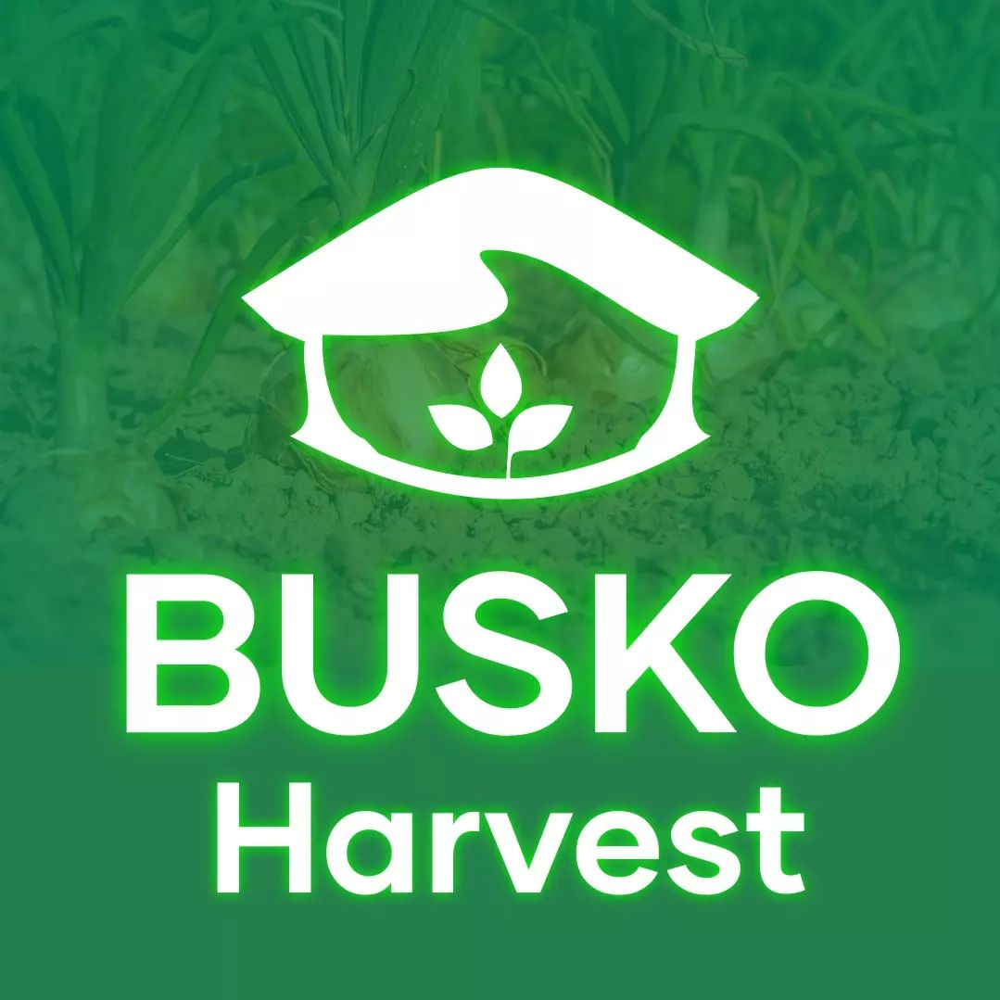

### Portfolio de Joseph Samuel Jonathan 💻

Bienvenue sur le portfolio de Joseph Samuel Jonathan ! Ce portfolio présente mes compétences en génie informatique, mes projets récents, mon parcours éducatif, et bien plus encore. 🚀

---

### 🌟 À Propos

Je suis un passionné de technologie, d'art et de musique, étudiant en génie informatique. Mon objectif est de développer des solutions innovantes et efficaces pour répondre aux besoins uniques de mes clients. Avec une solide expérience dans le développement de projets et de logiciels, je suis prêt à relever de nouveaux défis passionnants. 

### 🎓 Parcours Éducatif

- **Étude Classique**  
  - Collège Catts Pressoir, Port-au-Prince
  - Septembre 2013 - Septembre 2020
  - Parcours académique exceptionnel, démontrant un engagement constant envers l'excellence académique.

- **Génie Informatique**
  - ISTEAH: Institut des Sciences, des Technologies et des Etudes Avancées d'Haïti, Delmas 60
  - Septembre 2021 - Septembre 2026
  - Formation approfondie en architecture, algorithmes, et langages de programmation.

### 💼 Expérience Professionnelle

- **Professeur de Technologie**
  - Collège Catts Pressoir, Port-au-Prince
  - Mars 2022 - Juillet 2023
  - Enseignement de la technologie et de la robotique, stimulant l'intérêt des élèves pour les sciences et la technologie.

---

### 🚀 Compétences

#### Développement d'Applications Mobiles
- Flutter
- Java (Android)
- Swift (iOS)
- Dart

#### Développement Web
- HTML
- CSS
- JavaScript
- Python (Django, Flask)
- React.js
- Vue.js
- Bootstrap

#### Développement d'Applications de Bureau
- Java (Swing, JavaFX)
- C# (Windows Forms, WPF)
- Python (Tkinter)
- Electron.js

#### Intelligence Artificielle (AI)
- TensorFlow
- PyTorch
- Scikit-Learn
- OpenCV

---

### 🛠️ Projets

1. **Busko**  
   Une application de gestion de base de données pour les entreprises, gérant les ressources humaines et matérielles.
   
   [Voir Projet](#)

2. **Busko Harvest**  
   Une application intelligente de gestion de culture pour une agriculture verte et durable.
   
 
3. **ArmaWatch**  
   Une application de surveillance pour la détection d'armes à feu et d'enlèvements.
   
 

4. **SpeakSight**  
   Des lunettes intelligentes pour les personnes sourdes.
   
   [Voir Projet](#)

---

### 📫 Contact

Vous avez un projet intéressant ? N'hésitez pas à me contacter !

- **Email** : [josephsamueljonathan@gmail.com](#)
- **Téléphone** : [+(509) 47520306](#)

---

### 🌐 Liens Utiles

- [LinkedIn](https://www.linkedin.com/in/samuel-j-845011245/)
- [GitHub](https://github.com/josephsamueljonathan)
- [Portfolio en Ligne](#)
Ce code est inspiré du portfolio de [Cal Shawn](https://calshawn.netlify.app/). N'hésitez pas à regarder son travail sur [GitHub](https://github.com/MuneneCalvin/Responsive-portfolio-website).
---

### 📝 Licence

Ce portfolio est sous licence 🍷 2024 Joseph Samuel Jonathan. Copyleft🗿(GIGACHAD). 👀AUCUN droits réservés. Imaginez une légende selon laquelle j'ai trop mis de copyright et maintenant j'ai des problèmes pour me souvenir de tous les endroits où je l'ai mis... 🤣

---

N'hésitez pas à explorer mes projets et à me contacter pour toute collaboration ou opportunité intéressante ! ✨
